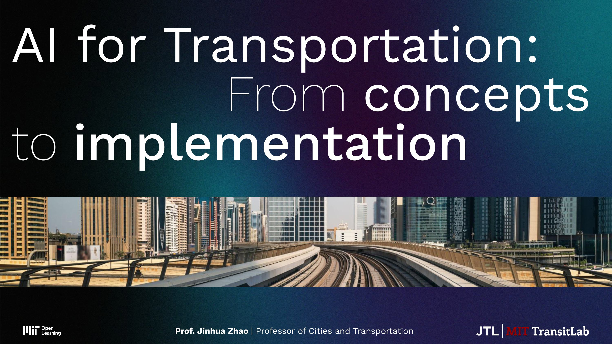

# MIT Universal AI 2025 Course | Transportation - AI for Transportation: From concepts to implementation

**Course Link:** 

Welcome to the MIT Open Learning Universal AI (UAI) course! This section on _Transportation_ is presented by [Professor Jinhua Zhao](https://www.linkedin.com/in/jinhuazhao/), Professor of City and Transportation Planning at the MIT Department of Urban Studies and Planning (DUSP). Through a series of four lectures, we will cover the following topics:

- Lecture 1: Introduction to Mobility Systems and Grounded AI
- Lecture 2: Deep Neural Networks and Discrete Choice Models
- Lecture 3: Real-World AI Case Studies
- Lecture 4: Generative AI

## Lectures

In the [`lectures`](./lectures/) folder, you can find the lecture slides, together with READMEs linking the lecture recordings published on YouTube. Each lecture is subdivided into 4-5 sections, to enable piecewise progression and learning in the course.

## Recitations

Each lecture is also accompanied with a respective recitation, which will enable you to learn more on the topic, while also applying the knowledge you have gather. Each recitation has multiple sections and features a set of slides, small quizzes on the learning platform, and optionally Google Colab notebooks. The latter notebooks are meant to provide you with an opportunity to experience, in a very hands-on matter, the current cutting edge applications of specialized AI models for urban mobility tasks. In these recitations we will cover:

- Recitation 1: Grounded AI Principles
- Recitation 2: Discrete Choice Modeling with ASU-DNN
- Recitation 3: Multi-Modal AI for Transit Data
- Recitation 4: Generative Urban AI

For each of these recitations, we will provide a self-paced worksheet, which allows you to attempt the exercises and questions discussed in the recitations by yourself, to enhance your learning experience. We generally recommend you to attempt the homework sheets first, followed by watching the recitation videos and at the sample solutions, if available.

## Acknowledgements

Preparing the material for this course would not have been possible without the following researchers:

- [Professor Jinhua Zhao](https://www.linkedin.com/in/jinhuazhao/)
- [Riccardo Fiorista](https://www.linkedin.com/in/riccardo-fiorista)
- [Awad Abdelhalim](https://www.linkedin.com/in/awad-abdelhalim/)
- [Michael Leong](https://www.linkedin.com/in/michaelleong8/)
- [Mingyi He](https://www.linkedin.com/in/mingyi-he-9782a92b1)
- [Professor Haris Koutsopoulos](https://www.linkedin.com/in/haris-n-koutsopoulos-6973a633/)
- [Professor Shenhao Wang](https://www.linkedin.com/in/shenhao-wang-9ab76256/)
- [Haris N. Koutsopoulos](https://www.linkedin.com/in/haris-n-koutsopoulos-6973a633/)
- [Yuebing Liang](https://www.linkedin.com/in/yuebing-liang-762923182)
